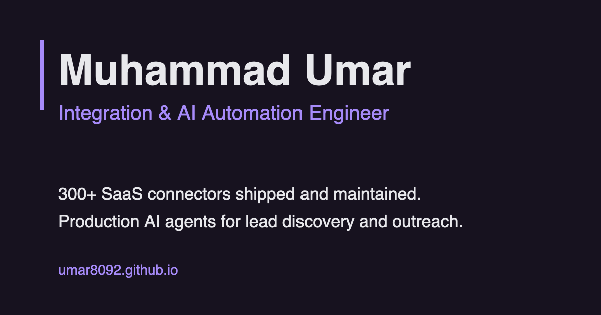

# umar8092.github.io

Source for the portfolio of **Muhammad Umar**, Senior Integration & AI Automation Engineer.

**Live site:** https://umar8092.github.io



## What's on the site

- **Delivered projects:** case studies of production integrations and AI-agent workflows, each with its architecture and delivery flow (`projects/`)
- **Apps worked with:** a searchable list of the 300+ SaaS apps I've integrated
- **Instant lead reply demo:** an interactive demo of an AI agent replying to a new lead (`instant-lead-reply-demo/`)
- **Experience, FAQ, and a 15-minute booking link**

## Built with

Plain HTML, CSS and JavaScript, hosted on GitHub Pages. No framework. `build-case-studies.mjs` is a small Node script that generates the case-study pages.

## Run it locally

```
git clone https://github.com/umar8092/umar8092.github.io.git
cd umar8092.github.io
# open index.html in a browser, or serve the folder:
python3 -m http.server 8000
```

## Contact

[LinkedIn](https://www.linkedin.com/in/umar8092) · [Email](mailto:umar8092@gmail.com) · [Free web apps](https://umar8092.github.io/apps)

## License

The code is [MIT licensed](LICENSE). The written content, case studies and photos are © Muhammad Umar and not covered by the license.
